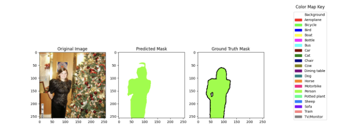
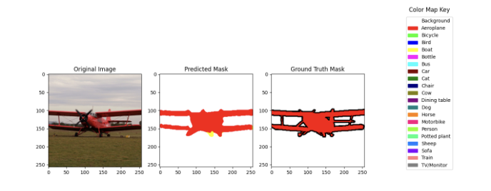

# Segmentation

## Segnet


Because training a segmentation model from scratch takes a long time to converge, I decided to replace
the encoder with a pretrained VGGnet on imagenet. This allows the model to focus solely on training the decoder
with an already good feature extraction, beneficial especially on a hard dataset such as pascal VOC.
Here is an example of a segnet output after ~100 epochs.


## Unet


The Unet is a variation on the Segnet mainly characterized by its skip connections and U-shape. The reason why
these skip connections are so useful is that they are concatenated back on the decoder network. Not only does this
help with gradient flow, but it also provides a sense of locality of the original images back into the decoder while
reconstructing. Here are some segmentation from Unet.




## Train Model   
```python train.py -d [dataset_name] -m [model_name] -t [tag_name]```
### if loading in model
```python train.py -d [dataset_name] -m [model_name] -p [file_path] -t [tag_name]```

## Run Tensorboard   
```tensorboard --logdir saves```

